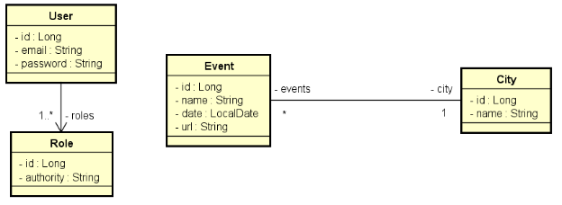

# Desafio Validação e Segurança

### Implemente as funcionalidades necessárias para que os testes do projeto abaixo passem.

### Este é um sistema de eventos e cidades com uma relação N-1 entre eles:
<h1 align="left">
  
</h1>

### 🛠 Tecnologias

As seguintes ferramentas foram usadas na construção do projeto:

- [Java Spring Boot](https://spring.io/)
- [Java Spring Data](https://spring.io/projects/spring-data)
- [Java Spring Web](https://spring.io/projects/spring-ws)
- [Java Spring H2 Database](https://www.baeldung.com/spring-boot-h2-database)
- [Java Spring Validation](https://spring.io/guides/gs/validating-form-input)
- [Java Spring Security](https://spring.io/projects/spring-security)

### Regras de controle de acesso:
- Somente rotas de leitura (GET) de eventos e cidades são públicas (não requer login).
- Usuários CLIENT e/ou ADMIN podem inserir novos eventos (POST).
- Os demais acessos são permitidos apenas a usuários ADMIN.

### Regras de validação de City:
 - Nome não pode ser vazio

### Regras de validação de Event:
- Nome não pode ser vazio
- Data não pode ser passada
- Cidade não pode ser nula

